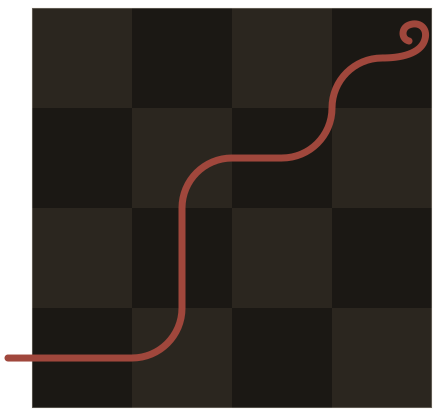

  

<h1 align="center">Ariadne</h1>

Ariadne is a UCI-compliant chess engine, written in Go. Currently it doesn't do anything surprising, but once it hits a solid foundation I want to make it much more experimental. Watch this space!
